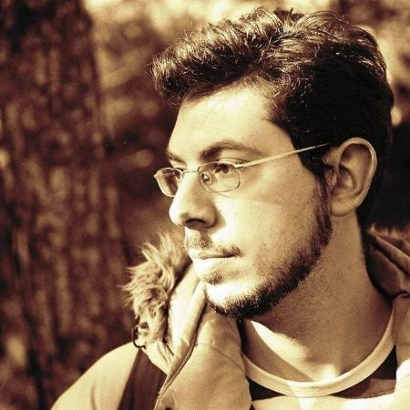

## Research interests

My research interests include extremophile organisms, adaptations, adaptation prediction, biological database development, human disease, disease genes, microRNAs, data analysis and data/text mining. 

I joined the [Lab42open](https://lab42open.hcmr.gr/) in March 2023 to participate in the project [CCMRI](http://ccmri.hcmr.gr/) which aims to harvest the metagenomic records pertaining to Climate Change and offer researchers a web-based notification service when relevant records become available.

## Brief CV

#### Jan 2026 - present
  * Post-Doctoral Researcher at [FoodigIT Centre, Thessaloniki](https://foodigit.eu/).  
    Tasks: Food genomics, data integration, and bioinformatics research.
  
#### Mar 2023 - Oct 2025
  * Post-Doctoral Researcher at Hellenic Centre for Marine Research (HCMR).  
    Tasks: Metagenomic data analysis, extremophile organisms, climate change-related microbial genomics.

#### Mar 2016 - Feb 2023
  * PhD on Comparative genomics of halophilic organisms. Research on data mining, amino acid profiling, evolutionary biology, and phylogenomics of extremophile microbes. Supervisor: Assist. Prof. Ilias Kappas. Dissertation funded by H.F.R.I.

#### Sep 2015 - Mar 2016
  * Research assistant in Aristotle University of Thessaloniki, Greece.  
    Tasks: Data mining and creation of [HaloDom](http://halodom.bio.auth.gr/), a biological database of halophilic species. Bioinformatics research on extremophile microbes and student exams supervisor.
  
#### Oct 2010 - July 2013
  * MSc in Applied Genetics and Biotechnology, Aristotle University of Thessaloniki (Greece).  
    Thesis: [In silico prediction of microRNAs within the introns of genes associated with diseases of the human nervous system](http://ikee.lib.auth.gr/record/278315/files/loukas.pdf)
  
#### Oct 2004 - July 2010
  * Undergraduate studies in Computer Science and Biomedical Informatics, University of Thessaly (Greece).  
    Thesis: [Methodologies in haplotype analysis](https://core.ac.uk/download/pdf/132817664.pdf)

## Contact

[GitHub](https://github.com/loukalexis/) | [LinkedIn](https://www.linkedin.com/in/alexiosloukas/)

<aloukas@bio.auth.gr> | <alexlou@agro.auth.gr>
